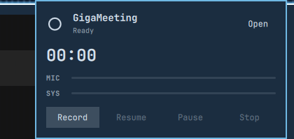

# GigaMeeting

<p align="center">
  
</p>

<p align="center">
  <strong>The meeting on your calendar, from the bar.</strong><br>
  Join it, record it under that name, and run your action when the transcript is ready.
</p>

<p align="center">
  <a href="LICENSE"></a>
  
  
</p>

GigaMeeting is a bar card. It does not record, and it does not transcribe.

> [!IMPORTANT]
> Install **[Meeting Recorder](https://github.com/jankeesvw/omarchy-meeting-recorder)** before this plugin. Meeting Recorder is the app that records your microphone and the computer audio and writes the transcript on this computer. Open it from the launcher and confirm the name **Meeting Recorder**. Without that app, the card has nothing to start.

An independent [MIT](LICENSE)-licensed plugin by [GigaSolo](https://github.com/gigasolo) for [Omarchy](https://omarchy.org/).

## Install Meeting Recorder

```sh
yay -S omarchy-meeting-recorder
```

That is the same install [Meeting Recorder documents](https://github.com/jankeesvw/omarchy-meeting-recorder#install). The package on disk is `omarchy-meeting-recorder-bin`. The first transcription downloads the speech model, about 1.6 GB, once.

`hey` is optional. When it is signed in, opening the card reads today's timed meetings from it. `omacal` is the spare: if HEY cannot be reached, it still offers the one meeting that is happening now or starts within 15 minutes. Without either, the card stays on Record.

## Install the card

```sh
omarchy plugin add https://github.com/gigasolo/gigameeting.git
```

Omarchy may ask which side of the bar to use. The default is the right.

> [!IMPORTANT]
> Plugins run as unsandboxed code inside `omarchy-shell`. Read the source before you enable a plugin you do not already trust.

To review it before it appears on the bar:

```sh
omarchy plugin add https://github.com/gigasolo/gigameeting.git
less ~/.config/omarchy/plugins/gigasolo.gigameeting/README.md
omarchy plugin enable gigasolo.gigameeting --section right
```

## The card

Click the icon to open the card. Click it again to close. The icon never starts a recording.

| | |
| --- | --- |
| **Record** | Starts Meeting Recorder when it is ready. |
| **Join and record** | A timed event is happening, or starts within 15 minutes. The recording takes the event's name. All-day events are skipped. |
| **Later** | The other timed meetings today, a few rows, clock and title. A row does not start a recording. |
| **Prep** | Writes a short brief in the vault from that invite and past notes that mention the same people, or the same meeting title. Open brief jumps to it. Nothing is sent. |
| **History** | Turns the card over to recent recordings, grouped by day. Play plays that recording in the card. Transcript and Insights open the note, and the next link still works. Today turns it back. A row does not start a recording. |
| **Pause** | Holds the take. Resume continues it. |
| **Stop** | Saves the recording and transcribes it. |
| **The action** | After a take this card watched finish, your Meeting Recorder action is the button. The chevron runs another action, or sets the default. Nothing runs by itself. |

Actions are read from `~/.config/omarchy-meeting-recorder/config.toml` each time the card needs them. Meeting Recorder has no action editor. Change the file, and the next open picks it up.

The default action is remembered in `~/.local/state/omarchy/gigameeting-default-action`.

## File the notes

`meeting-manage` is part of this repo. It files the transcript into an Obsidian vault. `both` and `insights` also ask Grok for the notes. `file`, `status`, `sync`, and `open` do not.

Meeting Recorder runs whatever command is in its action. Save to Obsidian is:

```toml
[[action]]
name = "Save to Obsidian"
command = "~/.local/bin/meeting-manage both"
```

Point that path at this repo:

```sh
ln -sf ~/.config/omarchy/plugins/gigasolo.gigameeting/meeting-manage ~/.local/bin/meeting-manage
```

The vault defaults to `~/Documents/Obsidian`, the notes folder to `Meetings`, and the recordings to `~/Documents/Meetings`. `OBSIDIAN_VAULT`, `OBSIDIAN_FOLDER`, and `MEETINGS_ROOT` override those.

## Remove

```sh
omarchy plugin remove gigasolo.gigameeting
```

Removal leaves the default-action file in place. Delete `~/.local/state/omarchy/gigameeting-default-action` if you do not want that name kept. Removing the card does not remove Meeting Recorder.

```sh
sudo pacman -R omarchy-meeting-recorder-bin
```

## Marketplace

The shell lists this plugin under Audio. On the [Omarchy plugin marketplace](https://plugins.omarchy.org/publish.html) form, the category is Productivity and the tags are Bar and Quickshell.
